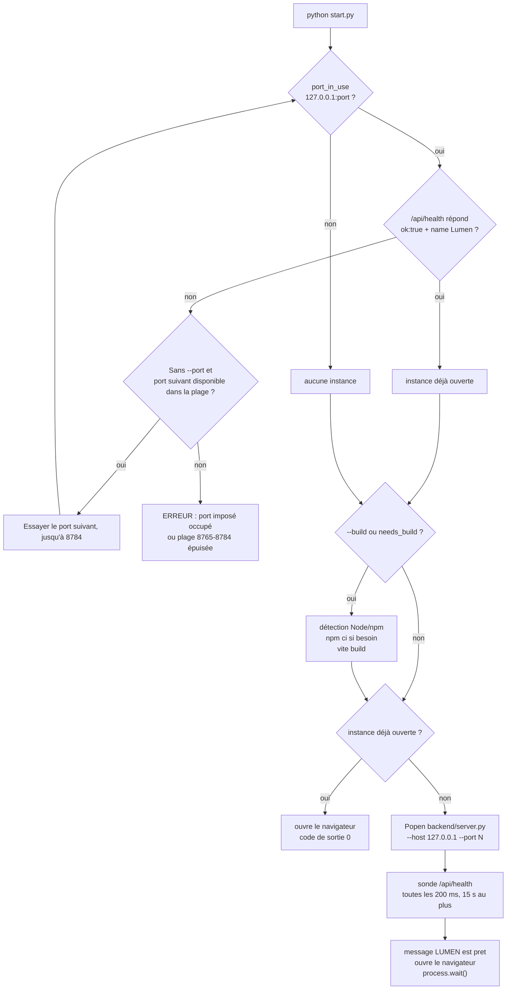

# Démarrage : faire tourner le jeu

Ce document s'adresse à qui vient de récupérer LUMEN et veut le voir tourner, pour y jouer ou pour commencer à le modifier. Il donne les prérequis réels selon la situation, la séquence exacte du premier lancement, toutes les options du lanceur, la façon de l'arrêter, et un tableau de dépannage.

Point le plus important, à lire avant tout le reste : **le dossier `dist/` (le jeu construit) est ignoré par git** ([.gitignore:2](../.gitignore#L2) ; vérifié : `git ls-files dist` ne renvoie aucune ligne). Un clone frais ne contient donc **aucun build** et exige Node.js plus une connexion Internet au premier lancement. Le README, qui promet « seulement Python 3.10 » ([README.md:17](../README.md#L17)) et « une version construite dans `dist/` » ([README.md:104](../README.md#L104)), décrit un **dossier livré et copié à la main**, pas un dépôt cloné.

---

## 1. Deux situations, deux jeux de prérequis

| | Cas A — jouer avec un `dist/` déjà construit | Cas B — construire depuis les sources |
|---|---|---|
| Situation typique | Dossier reçu par copie, clé USB, archive ZIP | `git clone`, ou toute modification de `src/`, `index.html`, `package.json` |
| Python | **3.10 ou plus récent** ([Lancer-le-jeu.cmd:14](../Lancer-le-jeu.cmd#L14) et [:19](../Lancer-le-jeu.cmd#L19)) | idem |
| Dépendances Python | **Aucune** : lanceur et serveur n'utilisent que la bibliothèque standard ([start.py:6-18](../start.py#L6), [backend/server.py:4-11](../backend/server.py#L4)). Pas de `requirements.txt`, pas d'environnement virtuel | idem |
| Node.js | **Inutile** | **22.12 ou plus récent** ([start.py:40](../start.py#L40), redéclaré dans [package.json:22](../package.json#L22)) |
| npm | **Inutile** | **Obligatoire, et sous une forme précise** : le lanceur exige un fichier `npm-cli.js` (voir le dépannage, §8) |
| Internet | **Non** — le jeu et ses polices sont entièrement locaux (`@import` de paquets npm dans [src/style.css:1-2](../src/style.css#L1), aucun appel à un service de polices distant) | **Oui, à la première préparation** : `npm ci` télécharge les dépendances ([start.py:80](../start.py#L80)) |
| Navigateur | Récent, **avec WebGL actif** : toute la scène est un canvas WebGL ([src/scene.js:36](../src/scene.js#L36)) | idem |
| Encombrement | `dist/` ≈ 1,0 Mo | plus `node_modules/` et le cache npm confiné dans `work/.npm-cache` |

> **Déduit :** rien dans le code n'exige réellement Python 3.10. Les annotations `str | None` du moteur ne sont jamais évaluées grâce à `from __future__ import annotations`, et `Path.is_relative_to` existe depuis 3.9. Le plancher 3.10 est affirmé par le `.cmd` et le README ; la fonctionnalité qui l'imposerait n'est **pas déterminée à la lecture du code**.

> **Constaté sur la machine de vérification :** Python 3.11.9 (PATH), Node v24.13.0, npm 11.6.2. Le lanceur reconnaît aussi le runtime livré avec Codex : `~/.cache/codex-runtimes/codex-primary-runtime/dependencies/` fournit ici Python 3.12.14 **et** Node v24.19.0, mais **pas npm** (aucun `npm-cli.js` sous ce dossier). Ce runtime permet donc de *jouer*, jamais de *construire*.

---

## 2. Le chemin le plus court, sous Windows

**Double-cliquez sur `Lancer-le-jeu.cmd`.** Une fenêtre de console s'ouvre ; gardez-la ouverte pendant toute la partie, c'est elle qui héberge le serveur.

Ce que ce fichier fait, dans l'ordre ([Lancer-le-jeu.cmd](../Lancer-le-jeu.cmd)) :

1. `cd /d "%~dp0"` : se place dans le dossier du projet, quel que soit le raccourci utilisé ([:3](../Lancer-le-jeu.cmd#L3)).
2. Si `%USERPROFILE%\.cache\codex-runtimes\codex-primary-runtime\dependencies\python\python.exe` existe, **il est retenu immédiatement, sans aucun contrôle de version** ([:8-11](../Lancer-le-jeu.cmd#L8)).
3. Sinon il exécute réellement `python -c "import sys; sys.exit(0 if sys.version_info >= (3, 10) else 1)"` ([:14](../Lancer-le-jeu.cmd#L14)). Le commentaire de la ligne 13 en donne la raison : sous Windows, `python` peut être un alias du Microsoft Store qui ouvre le magasin au lieu de s'exécuter.
4. Sinon il retente le même test avec `py -3` ([:19](../Lancer-le-jeu.cmd#L19)).
5. Sinon il affiche « Python 3.10 ou plus recent est necessaire. », fait `pause` et rend 1 ([:22-25](../Lancer-le-jeu.cmd#L22)).
6. Il appelle enfin `start.py`, en lui transmettant ses propres arguments via `%*` ([:28](../Lancer-le-jeu.cmd#L28) ou [:32](../Lancer-le-jeu.cmd#L32)).

Trois conséquences à connaître :

- **Sur une machine équipée du runtime Codex, votre Python personnel n'est jamais utilisé** par le `.cmd`. Pour forcer le vôtre, appelez `python start.py` directement.
- **Un double-clic ne transmet aucun argument.** Le lanceur essaie automatiquement les ports 8765 à 8784. Pour imposer un port précis, passez par un terminal ou un raccourci portant `--port N`.
- Le `.cmd` **ne vérifie jamais Node** : un problème de construction n'apparaît que plus tard, dans le message d'erreur de `start.py`.

## 3. La commande multiplateforme

Depuis la racine du projet (Windows, macOS ou Linux) :

```sh
python start.py
```

Utilisez `python3 start.py` si votre système nomme l'interpréteur `python3` ([README.md:15](../README.md#L15)). C'est exactement ce que le `.cmd` finit par exécuter ; tout le reste de ce document décrit `start.py`.

---

## 4. Ce qui se passe pendant le premier lancement



Étape par étape, avec ce que chacune coûte :

| # | Étape | Code | Durée | Internet |
|---|---|---|---|---|
| 1 | Sonde TCP du port, sur `127.0.0.1` et en IPv4 uniquement | [start.py:110-113](../start.py#L110) | ≤ 0,3 s (délai d'attente) | non |
| 2 | Si le port répond mais n'est pas LUMEN : essayer le suivant jusqu'à 8784 ; arrêt si `--port` est imposé ou si la plage est épuisée | [select_port](../start.py#L116) | Jusqu'à 0,8 s par contrôle HTTP | non |
| 3 | Décision de reconstruction : `dist/index.html` absent, ou une source plus récente que lui | [start.py:86-98](../start.py#L86) | < 1 s (parcours de `src/` et `public/`) | non |
| 4 | Création de `work/`, détection de Node puis de npm | [start.py:133-134](../start.py#L133) | < 1 s | non |
| 5 | `npm ci --no-audit --no-fund` si une dépendance directe manque ou si l'empreinte de `package.json`/`package-lock.json` a changé. Message affiché : « Preparation des dependances (Internet requis la premiere fois)... » | [start.py:73-83](../start.py#L73) | **non mesurée ici** : dépend du réseau (de quelques dizaines de secondes à plusieurs minutes) | **oui** |
| 6 | `npm run build`, c'est-à-dire `vite build --configLoader native` | [start.py:140](../start.py#L140), [package.json:8](../package.json#L8) | **7,6 à 7,9 s mesurés** (49 modules) | non |
| 7 | Si une instance LUMEN tournait déjà : ouverture du navigateur et sortie avec le code 0 | [start.py:141-145](../start.py#L141) | — | non |
| 8 | Démarrage du serveur en sous-processus, avec **le même interpréteur** que `start.py` (`sys.executable`) | [start.py:147-150](../start.py#L147) | ~0,3 s | non |
| 9 | Attente de `/api/health` : 200 ms entre deux essais, 15 s au total ; échec immédiat si le fils meurt | [start.py:151-159](../start.py#L151) | ~0,2 s | non |
| 10 | Message « LUMEN est pret : http://127.0.0.1:8765 » puis `webbrowser.open` | [start.py:160-162](../start.py#L160) | — | non |
| 11 | `start.py` reste bloqué sur `process.wait()` et propage le code de sortie du serveur | [start.py:163](../start.py#L163) | durée de la partie | non |

**Mesures de bout en bout** (Windows 11, Python 3.11.9, Node v24.13.0, dépendances déjà installées) :

| Scénario | Temps jusqu'au message « LUMEN est pret » |
|---|---|
| `dist/` à jour, rien à reconstruire | **1,2 s** |
| `python start.py --build` (build complet, sans `npm ci`) | **12,2 s** |

> **Déduit :** le seul poste réellement coûteux, et le seul qui exige le réseau, est l'étape 5. Les lancements suivants réutilisent `node_modules/` et le cache confiné dans `work/.npm-cache` ([start.py:137](../start.py#L137)), qui n'est **pas** partagé avec `~/.npm` : chaque copie du projet retélécharge tout.

Deux lignes apparaissent dans la console au démarrage : celle du serveur (`Lumen Taquin : http://127.0.0.1:<port>`, [backend/server.py:186](../backend/server.py#L186)) puis celle du lanceur (`LUMEN est pret : ...`). Le serveur **ne journalise ensuite plus les requêtes réussies** : `log_message` ne laisse passer que les statuts autres que 200 et 204 ([backend/server.py:35-38](../backend/server.py#L35)). Une console muette pendant la partie est donc le comportement normal, pas le signe que rien n'arrive.

---

## 5. Toutes les options de `start.py`

Il y en a trois, plus l'aide fournie par `argparse` ([start.py:117-121](../start.py#L117)).

| Option | Effet | Détail vérifié |
|---|---|---|
| `--no-browser` | N'ouvre pas le navigateur | Les deux appels à `webbrowser.open` sont conditionnés ([start.py:143](../start.py#L143) et [:161](../start.py#L161)). L'adresse reste affichée dans la console |
| `--build` | Force la reconstruction du frontend | `if args.build or needs_build()` ([start.py:132](../start.py#L132)) : **Node et npm deviennent obligatoires même si `dist/` est parfaitement valide** |
| `--port N` | Impose le port local, sans repli automatique ; sans cette option, recherche de **8765 à 8784** | Refus hors 1..65535 avec « Le port doit etre compris entre 1 et 65535. » et code de sortie 2 ([start.py](../start.py)) |
| `-h`, `--help` | Aide générée par argparse | Description : « Lancer LUMEN, le prototype de taquin d'aventure. » |

Trois commandes d'exemple, telles qu'elles figurent dans le README ([README.md:23-27](../README.md#L23)) :

```sh
python start.py --no-browser
python start.py --build
python start.py --port 8766
```

Ce qui **n'existe pas** :

- **Aucune option `--host`.** L'adresse `127.0.0.1` est écrite en dur deux fois, dans l'URL sondée et dans la ligne de commande du serveur ([start.py:126](../start.py#L126) et [:148](../start.py#L148)). Impossible, via le lanceur, de faire jouer une tablette du réseau local.
- **Aucune option `--dist`.** Le serveur résout `dist/` par rapport à son propre emplacement ([backend/server.py:18](../backend/server.py#L18)) ; le paramètre `dist=` de `GameServer` n'est utilisé que par les tests.
- **Aucune option pour forcer la réinstallation des dépendances.** `--build` force le build, pas `npm ci`.

Le serveur, lui, accepte deux options quand on le lance seul ([backend/server.py:180-184](../backend/server.py#L180)) :

```sh
python backend/server.py --host 127.0.0.1 --port 8765
```

`--host` y est bien présent, sans authentification d'aucune sorte : exposer le serveur donne accès à toute l'API et à tout `dist/`.

---

## 6. Arrêter proprement

**Ctrl+C dans la fenêtre du lanceur.** C'est la voie documentée ([README.md:29](../README.md#L29)) et la seule propre :

1. `KeyboardInterrupt` est intercepté, « Arret de LUMEN. » s'affiche, `start.py` rend 0 ([start.py:164-166](../start.py#L164)).
2. Le bloc `finally` fait `terminate()`, attend 5 s, puis `kill()` si nécessaire ([start.py:170-177](../start.py#L170)).
3. Côté serveur, `KeyboardInterrupt` est également avalé et `server_close()` est appelé ([backend/server.py:188-192](../backend/server.py#L188)).

Ce que l'arrêt détruit et ce qu'il conserve :

| Donnée | Survit à l'arrêt ? | Pourquoi |
|---|---|---|
| Parties en cours | **Non** | Le registre `server.games` est un dictionnaire en mémoire du processus ([backend/server.py:27](../backend/server.py#L27)) |
| Niveaux terminés, records, dernier niveau joué, garde-robe | **Oui** | Quatre clés de `localStorage` du navigateur, listées par `SAVE_KEYS` ([src/campaign.js](../src/campaign.js)) : `lumen-session`, `lumen-level`, `lumen-progress`, `lumen-wardrobe`. Le carnet d'expédition les efface toutes d'un coup (« Recommencer l'aventure à zéro ») |
| `dist/`, `node_modules/`, `work/` | **Oui** | Fichiers sur disque, jamais nettoyés par le lanceur |

Au rechargement de la page, le client redemande sa session (`GET /api/game?id=...`), reçoit 404, avale silencieusement l'erreur et crée une partie neuve ([src/App.jsx:216](../src/App.jsx#L216)). Les records, eux, réapparaissent puisqu'ils vivent côté navigateur.

> **Constaté :** la fenêtre du `.cmd` ne fait `pause` que si le code de sortie est **non nul** ([Lancer-le-jeu.cmd:36](../Lancer-le-jeu.cmd#L36)). Après un Ctrl+C (code 0), comme sur le chemin « instance déjà ouverte » (code 0 aussi), **la fenêtre se ferme instantanément** : le message final n'est jamais lu.

> **Constaté (mesuré) :** tuer `start.py` de force — gestionnaire de tâches, `taskkill /F`, `Process.terminate()` depuis un script — **n'arrête pas le serveur**. Son bloc `finally` ne s'exécute pas et le sous-processus `backend/server.py` reste en vie, port occupé. Le remède figure au tableau de dépannage.

---

## 7. Le mode développement Vite

Il existe, et il est documenté ([README.md:82-93](../README.md#L82)). Il demande **deux terminaux** à la racine du projet :

```sh
python backend/server.py --host 127.0.0.1 --port 8765
```

```sh
npm install
npm run dev
```

`npm run dev` vaut `vite --host 127.0.0.1 --configLoader native` ([package.json:7](../package.json#L7)). Ouvrez l'adresse **affichée par Vite** : le dépôt ne fixe aucun port pour le serveur de développement, c'est le défaut de l'outil qui s'applique.

### Déverrouiller la campagne pour tester

Les niveaux s'ouvrent un par un, ce qui est pénible quand on développe le dernier monde. Ajoutez **`?dev`** à l'adresse — celle de Vite comme celle du serveur Python — et tous les passages deviennent jouables, avec un badge **MODE DÉV** en haut de l'écran. Le mode est retenu pour l'onglet, `?dev=0` ou un clic sur le badge en sort, et fermer l'onglet y met fin ([src/dev-mode.js](../src/dev-mode.js)).

Rien de sauvegardé ne change : c'est la vérification du verrou qui est suspendue, pas la progression. Cela signifie aussi que le mode dév n'est **pas** un secret : il vit dans le code du client, comme le verrou lui-même, que le serveur n'applique pas non plus.

| | `python start.py` (serveur Python) | `npm run dev` (Vite) |
|---|---|---|
| Ce qui sert le client | `backend/server.py`, depuis `dist/` ([backend/server.py:151-177](../backend/server.py#L151)) | Vite, depuis les sources |
| Ce qui sert `/api` | Le même processus, sur la même origine | Le serveur Python, via le proxy de [vite.config.js:4](../vite.config.js#L4) |
| Prise en compte d'une modification de `src/` | Reconstruction complète (~8 s) puis rechargement | Rechargement à chaud, quasi immédiat |
| Utilise `dist/` | Oui | Non |
| Intérêt | Configuration nulle, un seul port, exactement ce que joue l'utilisateur final | Boucle de retour courte pour travailler l'interface et la 3D |
| Limites | Il faut relancer un build pour voir un changement | Deux processus à gérer ; **le port du backend est écrit en dur** dans le proxy ; ce n'est pas l'artefact réellement distribué |

**Le piège du mode développement.** Le proxy pointe littéralement sur `http://127.0.0.1:8765` ([vite.config.js:4](../vite.config.js#L4)) alors que `start.py` et `backend/server.py` acceptent tous deux `--port`. Si le backend écoute ailleurs, la page se charge normalement, l'écran d'accueil s'affiche, mais tous les appels `/api` échouent au niveau du proxy — sans le moindre message côté Python, qui ne reçoit rien. Il faut alors éditer `vite.config.js`.

**Nuance utile dans les deux modes :** on peut reconstruire `dist/` pendant qu'une instance tourne. Le serveur relit les octets du fichier à chaque requête et envoie `Cache-Control: no-store` ([backend/server.py:44](../backend/server.py#L44) et [:168](../backend/server.py#L168)) : un simple F5 sert le nouveau build sans redémarrer Python, et la partie en cours côté serveur est conservée. C'est d'ailleurs pour cela que `start.py` reconstruit **avant** de traiter le cas de l'instance déjà ouverte ([start.py:132](../start.py#L132) puis [:141](../start.py#L141)).

> **Piste d'amélioration :** rendre le port du proxy configurable (variable d'environnement lue dans `vite.config.js`) supprimerait la seule divergence de configuration entre les deux modes.

---

## 8. Dépannage

| Symptôme | Cause | Remède |
|---|---|---|
| `Le port N est deja utilise` ou `Aucun port disponible entre 8765 et 8784` | Le port imposé appartient à un autre service, ou toute la plage automatique est occupée ([select_port](../start.py#L116)) | Relancer sans `--port` pour le choix automatique, ou imposer un port libre avec `python start.py --port N`. Le double-clic gère automatiquement les conflits dans la plage 8765-8784 |
| Le port reste occupé alors que la fenêtre du lanceur est fermée | `start.py` a été tué de force : son `finally` n'a pas tourné et `backend/server.py` est resté orphelin (constaté) | Fermer le processus Python restant (`taskkill /PID <pid> /F`, ou le gestionnaire de tâches). Pour l'identifier : `Get-CimInstance Win32_Process` filtré sur `server.py` |
| La fenêtre s'ouvre puis se referme aussitôt, mais le navigateur s'ouvre | Chemin « instance déjà ouverte » : code de sortie 0, donc pas de `pause` ([start.py:141-145](../start.py#L141), [Lancer-le-jeu.cmd:36](../Lancer-le-jeu.cmd#L36)) | Rien à corriger : le jeu tourne déjà sur ce port. Pour lire les messages, lancer depuis un terminal |
| `Impossible de lancer LUMEN : Node.js 22.12 ou plus recent, avec npm, est necessaire.` | Node absent, antérieur à 22.12, **ou npm introuvable sous forme de fichier `npm-cli.js`** ([start.py:26-60](../start.py#L26)). Sous Windows, seuls cinq emplacements sont testés et le repli sur le `npm` du PATH est explicitement désactivé (`os.name != "nt"`, [start.py:58](../start.py#L58)) | Installer Node depuis le paquet officiel : il place `node_modules/npm/bin/npm-cli.js` à côté de `node.exe`. Le message parle de Node même quand c'est **npm** qui manque — cas du runtime Codex et des installations à shims (Volta, fnm, scoop, Corepack seul), où `npm --version` fonctionne pourtant. Contournement : lancer `npm run build` à la main, puis `python start.py`, qui ne reconstruira plus |
| `Python 3.10 ou plus recent est necessaire.` puis `pause` | Aucun des trois interpréteurs testés par le `.cmd` ne répond ou ne satisfait la version ([Lancer-le-jeu.cmd:14-25](../Lancer-le-jeu.cmd#L14)) | Installer Python en cochant « Add Python to PATH », puis rouvrir la fenêtre. Vérifier avec `python -c "import sys; print(sys.version_info)"` : un alias du Microsoft Store échoue à ce test |
| Après un `git clone`, le lanceur exige Node et Internet | **`dist/` est gitignoré** ([.gitignore:2](../.gitignore#L2)) : `needs_build()` renvoie vrai car `dist/index.html` est absent ([start.py:87-89](../start.py#L87)). Le « Python seul » du README ne vaut que pour un dossier copié | Installer Node 22.12+ et laisser le premier lancement construire. Après un `checkout`, toutes les sources ont une date récente : un build complet est de toute façon systématique |
| `Impossible de lancer LUMEN : Command '[..., npm-cli.js, ci, --no-audit, --no-fund]' returned non-zero exit status 1.` | `npm ci` a échoué : pas de réseau, registre inaccessible, ou `package-lock.json` désynchronisé de `package.json` (`npm ci` refuse alors de deviner) | Rétablir la connexion et relancer. En cas de désynchronisation, lancer `npm install` à la main pour régénérer le verrou. Les messages précis de npm restent visibles au-dessus, dans la même fenêtre |
| Le build échoue à **chaque** lancement sur une erreur de résolution de module, alors que `node_modules/` existe | Sceau collant : `changed` est faux quand `work/dependencies.sha256` n'existe pas, et le sceau est réécrit **même sans installation** ([start.py:78](../start.py#L78) et [:83](../start.py#L83)). Une installation interrompue laisse les dépendances directes en place et les transitives incomplètes : plus aucun `npm ci` n'est déclenché | Supprimer **à la fois** `node_modules/` et `work/dependencies.sha256`, puis relancer. Aucune option de ligne de commande ne le fait |
| Page entièrement blanche, aucun texte | `index.html` ne contient qu'un `<div id="root">` et un module ES ([index.html:12-13](../index.html#L12)) : ni `<noscript>`, ni message de repli. Si le bundle ou le CSS ne se charge pas, il ne reste rien à l'écran. Cas typiques : ouverture de `dist/index.html` en `file://` (les ressources sont référencées en chemins absolus, aucune option `base` dans [vite.config.js](../vite.config.js)), ou `dist/` incomplet | Toujours passer par `http://127.0.0.1:<port>` servi par Python. Ouvrir la console du navigateur : une erreur de module ou de type MIME s'y voit immédiatement. Reconstruire avec `python start.py --build` |
| Bandeau « Le rendu 3D nécessite WebGL. Activez l'accélération graphique du navigateur puis rechargez la page. » et bouton **Explorer** grisé | `new THREE.WebGLRenderer(...)` a levé une exception, traduite en message par le `try/catch` du montage ([src/App.jsx:243-245](../src/App.jsx#L243)). Le bandeau s'affiche sur l'accueil ([src/HomeScreen.jsx:143](../src/HomeScreen.jsx#L143)) et dans la coquille de jeu ([src/App.jsx:367](../src/App.jsx#L367)) | Activer l'accélération matérielle du navigateur, mettre à jour les pilotes, vérifier `about:gpu` (Chrome) ou `about:support` (Firefox). Le jeu **n'a aucun mode de repli 2D** : sans WebGL il est injouable |
| Bandeau « Le rendu 3D a été interrompu. Rechargez la page pour le rétablir. » | Perte du contexte WebGL, signalée par l'écouteur `webglcontextlost` ([src/scene.js:641-642](../src/scene.js#L641)) | Recharger la page ; le bouton « Réessayer » fait `location.reload()`. Aucun module ne reconstruit ses ressources : il n'existe pas de reprise sans rechargement |
| Bandeau « Le jeu attend son serveur Python. Lancez « Lancer-le-jeu.cmd », puis rechargez cette page. » | L'appel initial `GET /api/levels` a échoué ([src/App.jsx:226](../src/App.jsx#L226)) : serveur arrêté, ou client servi par Vite avec un proxy pointant sur le mauvais port | Vérifier que la fenêtre du lanceur est toujours ouverte, puis tester `http://127.0.0.1:8765/api/health`, qui doit répondre exactement `{"ok": true, "name": "Lumen Taquin"}` ([backend/server.py:101](../backend/server.py#L101)) |
| `404 {"error":"Fichier introuvable. Lancez le projet avec start.py."}` sur toutes les pages | Le serveur tourne mais `dist/` est absent ou vide ([backend/server.py:166-167](../backend/server.py#L166)) : `backend/server.py` démarre très bien sans build | `python start.py --build`, ou `npm run build` |
| **Aucun son** | Le son est **volontairement coupé au départ** : l'état initial vaut `false` ([src/App.jsx:78](../src/App.jsx#L78)) et l'`AudioContext` n'est même pas créé avant le premier `setEnabled(true)` ([src/audio.js:18](../src/audio.js#L18) et [:49](../src/audio.js#L49)) | Cliquer le bouton haut-parleur, ou appuyer sur **M** ([src/App.jsx:286](../src/App.jsx#L286) et [:343](../src/App.jsx#L343)). Le déverrouillage doit venir d'un vrai geste utilisateur, règle imposée par les navigateurs. Le réglage **n'est pas persisté** : il faut le réactiver à chaque chargement. Aucun fichier audio n'existe dans le dépôt, tout est synthétisé — un son absent n'est donc jamais un fichier manquant |
| Interface visible mais plateau vide en mode `npm run dev` | Proxy Vite figé sur le port 8765 ([vite.config.js:4](../vite.config.js#L4)) alors que le backend écoute ailleurs | Démarrer le backend sur 8765, ou modifier `vite.config.js` |
| Le navigateur ne s'ouvre pas | `webbrowser.open` ne signale rien si aucun navigateur par défaut n'est enregistré ([start.py:162](../start.py#L162)) | Ouvrir l'adresse affichée à la main. `--no-browser` produit délibérément le même effet |
| Une URL d'API renvoie du HTML avec le statut 200 | Le 404 JSON n'est émis que si le chemin commence **exactement** par `/api/` ([backend/server.py:117](../backend/server.py#L117)) ; sinon le repli SPA sert `index.html` ([:161-162](../backend/server.py#L161)). Vérifié : `/API/health`, `/%61pi/health` et `/api/health/` renvoient 200 en `text/html` | Vérifier la casse et la barre oblique finale de l'URL. Le symptôme côté client est un « Unexpected token '<' » sur `response.json()`, qui fait chercher un bug d'analyse JSON là où il n'y a qu'une faute de frappe |

---

## 9. Vérifier que l'installation est saine

Les trois commandes de référence ([README.md:120-123](../README.md#L120)), à lancer depuis la racine :

```sh
python -m unittest discover -s backend -v
node --test tests/motion.test.js
npm run build
```

| Commande | Résultat obtenu à la vérification | Prérequis |
|---|---|---|
| `python -m unittest discover -s backend` | **30 tests, OK, 1,35 s** | Python seul |
| `node --test tests/motion.test.js` | **7 tests, OK, 244 ms** | Node seul — `src/motion.js` n'importe rien, donc aucun `node_modules/` n'est nécessaire |
| `npm run build` | Construit `dist/` en **7,9 s** (49 modules, ~1,0 Mo) | Node plus `node_modules/` installé |

> **Attention :** `npm test` **n'existe pas**. Vérifié : `npm error Missing script: "test"` — [package.json:6-10](../package.json#L6) ne déclare que `dev`, `build` et `preview`. Il n'y a par ailleurs aucune intégration continue, aucun linter et aucun formateur dans le dépôt : ces trois commandes sont une discipline manuelle.

Un échec à l'**import** du module moteur (`AssertionError` pendant la collecte des tests, serveur qui refuse de démarrer) n'est pas un problème d'environnement : c'est le garde-fou de campagne qui parle, la validation des vingt-quatre solutions d'auteur étant exécutée au chargement de `backend/engine.py`. Corollaire : ne lancez jamais le jeu ni les tests avec `python -O`, qui désactiverait silencieusement ces `assert`.

---

## Pour aller plus loin

- [Bienvenue dans LUMEN](README.md) — index du workspace documentaire et carte de lecture.
- [Architecture et flux de données](02-architecture.md) — qui détient l'état de jeu, et pourquoi le client ne calcule rien.
- [Contrat de l'API HTTP](04-api-http.md) — les quatre routes, leurs corps JSON et leurs codes d'erreur, pour diagnostiquer autrement qu'à l'œil.
- [Tests, qualité et garde-fous](07-tests-et-qualite.md) — ce que couvrent réellement les 37 tests, et ce qu'ils ne couvrent pas.
- [Carte du code, fichier par fichier](09-carte-du-code.md) — où vivent `start.py`, `Lancer-le-jeu.cmd`, `vite.config.js` et les dossiers générés.
- [Contribuer au projet](10-contribuer.md) — mise en place d'un environnement de développement à partir d'un `git clone`.
