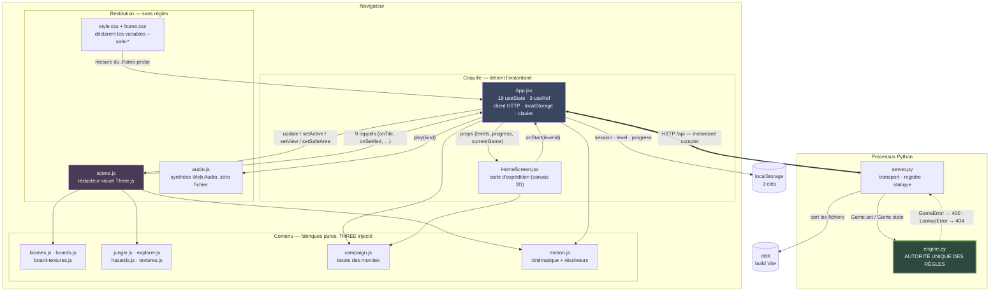
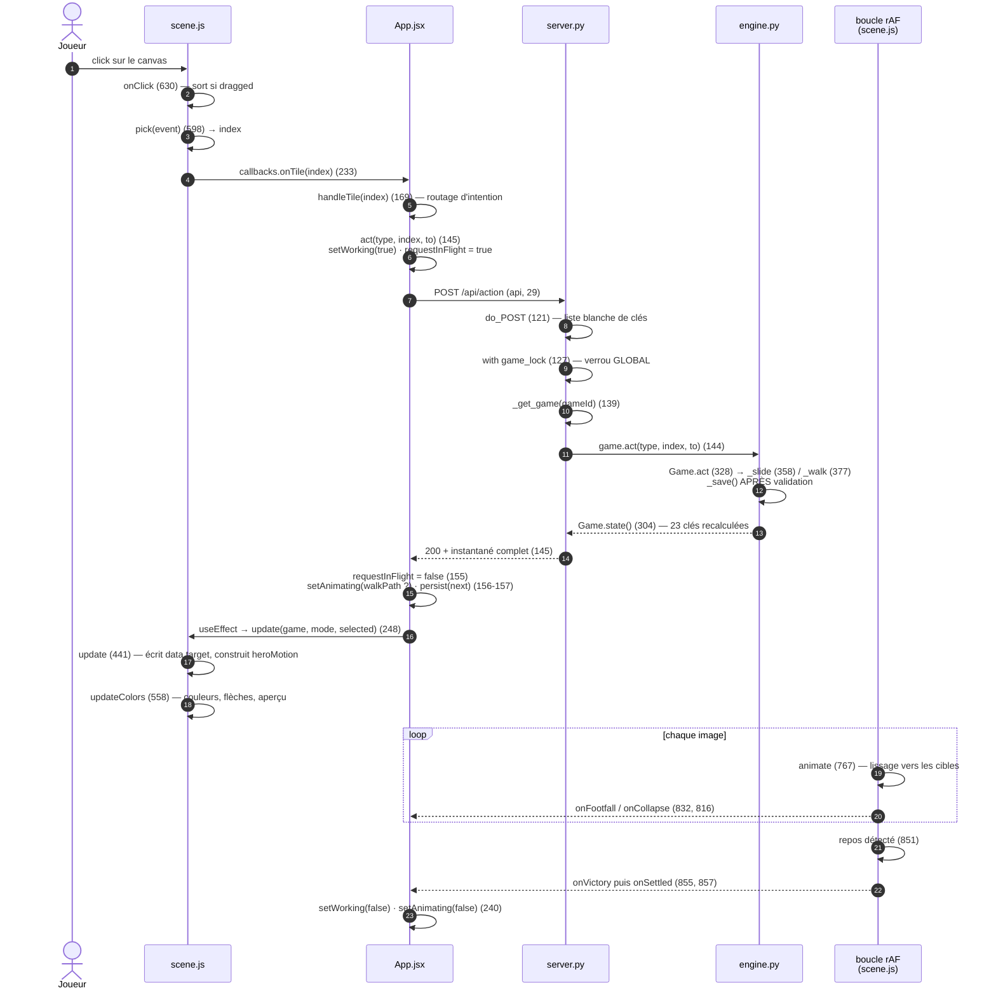
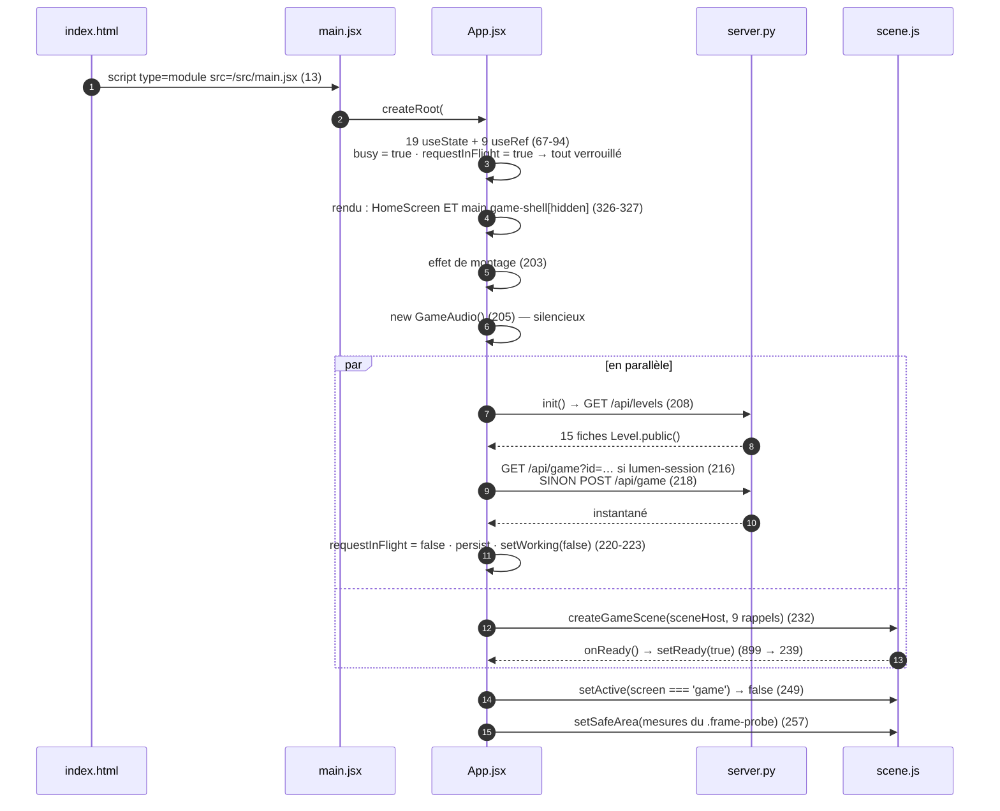
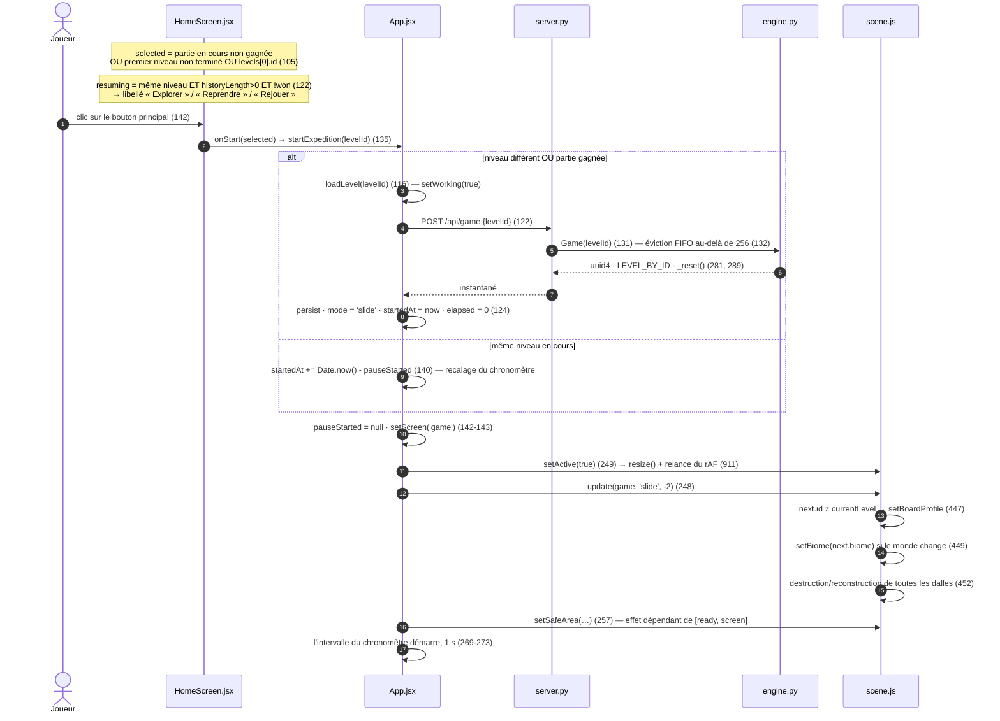

# Architecture et flux de données

Ce document s'adresse à quiconque doit modifier LUMEN sans le connaître. Il donne le découpage en couches
et sa justification, la réponse à la seule question qui compte au départ — *qui détient la vérité de l'état
de jeu ?* —, deux parcours complets tracés fonction par fonction, la frontière client/serveur, et les
décisions structurantes reconstituées avec leur contrepartie.

> **Chiffres recomptés le 2026-09-09.** Le dépôt bouge plus vite que sa documentation.
> À cette date : [src/scene.js](../src/scene.js) = **961** lignes, [src/App.jsx](../src/App.jsx) = **431**,
> total mesuré **4 982** lignes. Les tests passent : 30 tests Python, 7 tests Node.
> Recomptez avant de citer un chiffre.

**Comptes ajoutés le 2026-09-11 :** l'accès au jeu nécessite désormais une session. [backend/accounts.py](../backend/accounts.py) conserve les comptes et la progression dans un JSON privé ; [src/account.js](../src/account.js) gère les profils locaux, la file de synchronisation et les conflits. Les parties restent en mémoire mais sont liées à leur propriétaire. Voir [les protections et limites](../README.md#comptes-et-protection). Les métriques historiques ci-dessous ne couvrent pas cet ajout.

---

## 1. Cinq couches, une seule autorité

| # | Couche | Fichiers | Rôle exact | Détient des règles ? |
|---|---|---|---|---|
| 1 | **Moteur** | [backend/engine.py](../backend/engine.py) (995 l.) | Définit et fait respecter la totalité des règles. Détient le plateau, la position de Lumen, l'historique, les dangers de dalle, les gardiens en maraude, la marée, les sceaux, les reliques, le solveur d'indices, la campagne des 24 niveaux | **Oui, exclusivement** |
| 2 | **Transport HTTP** | [backend/server.py](../backend/server.py) (196 l.) | Traduit HTTP ⇄ moteur. Validation de forme, registre de parties en mémoire, service statique de `dist/` | Non |
| 3 | **Coquille cliente** | [src/App.jsx](../src/App.jsx) (431 l.), [src/HomeScreen.jsx](../src/HomeScreen.jsx) (147 l.), [src/main.jsx](../src/main.jsx) | Détient l'**instantané** de l'état serveur, capte les intentions, les traduit en actions HTTP | Non |
| 4 | **Restitution** | [src/scene.js](../src/scene.js) (961 l.), [src/audio.js](../src/audio.js) (199 l.), CSS | Transforme un instantané en images et en sons | Non |
| 5 | **Contenu** | [src/biomes.js](../src/biomes.js), [src/boards.js](../src/boards.js), [src/board-textures.js](../src/board-textures.js), [src/jungle.js](../src/jungle.js), [src/explorer.js](../src/explorer.js), [src/hazards.js](../src/hazards.js), [src/textures.js](../src/textures.js), [src/campaign.js](../src/campaign.js) | Fabriques pures, sans état de jeu : un sous-arbre 3D ou une table éditoriale | Non |

Hors couches : le **lanceur** [start.py](../start.py) (181 l.) et [Lancer-le-jeu.cmd](../Lancer-le-jeu.cmd),
qui détectent les runtimes, décident s'il faut reconstruire, démarrent le serveur et ouvrent le navigateur.

### Pourquoi ce découpage

Le projet n'est pas découpé pour faire joli : chaque frontière répond à une contrainte identifiable.

**Le moteur est isolé parce que les règles sont subtiles et doivent être testables sans HTTP.**
Le graphe de circulation est **orienté** : un courant contraint la direction de départ et une dalle
fragile s'effondre derrière Lumen. Les marches du joueur peuvent entrer sur une case crocodile ;
`stop_at_crocodile` arrête le trajet à la première capture. Le solveur et les indices conservent des
routes sûres via `paths_from`, sans cette autorisation. L'état expose `lost` et `caughtBy` ; après
l'échec, seule l'action `reset` est acceptée. La scène anime la capture à l'arrivée, puis signale
`onDefeat` avant `onSettled` pour afficher les choix de redémarrage et de retour à la carte.
L'espace d'états du solveur reste indexé sur le couple (plateau, héros). Conséquence
pratique : **25 des 30 tests** de [backend/test_engine.py](../backend/test_engine.py) n'ouvrent aucune
socket (19 dans `RulesTests`, 6 dans `HazardTests` ; seuls les 5 tests d'`ApiTests` montent un serveur).

**Le serveur ne contient aucune règle parce qu'il n'en a pas besoin.** Il ne connaît ni `SIZE`, ni `FINISH`,
ni les noms des dangers. Ses trois seules responsabilités sont la validation de forme (liste blanche de
clés, `type(v) is int`), le registre de parties, et le service statique. 196 lignes suffisent.

**La coquille détient un instantané, pas un modèle.** Elle ne calcule jamais un coup légal : elle valide
ses clics contre les listes que le serveur lui a fournies (`slideOptions`, `reachable`). Voir
[`handleTile`](../src/App.jsx#L169) : le seul test métier qu'elle fait est
`current.game.slideOptions?.some(...)` ([src/App.jsx:173](../src/App.jsx#L173)).

**La scène est un réducteur visuel.** Elle ne reçoit jamais d'ordre d'animation. `update()` écrit des
**cibles** (`data.target`, [src/scene.js:474](../src/scene.js#L474)) et la boucle de rendu converge par
lissage exponentiel ([src/scene.js:794](../src/scene.js#L794)). Un glissement se lit « même `tile.id`,
nouvel index » — aucune instruction de mouvement n'existe dans le protocole.

**La couche contenu reçoit `THREE` par paramètre.** Aucun de ces modules n'importe `three` : ils reçoivent
la bibliothèque en argument, possèdent leurs ressources GPU dans des `Set` locaux et exposent toujours un
`dispose()`. C'est ce qui permet à [src/scene.js](../src/scene.js) d'être le seul propriétaire du contexte
WebGL.

---

## 2. Qui détient la vérité de l'état de jeu

### La vérité : l'objet `Game` en mémoire du processus Python

`Game` ([backend/engine.py:280](../backend/engine.py#L280)) est **la seule instance de l'état de jeu**.
Il détient `tiles`, `hero`, `previous_hero`, `moves`, `steps`, `history`, `hint`, `walk_path`, `collapsed`
et `message`.

Deux points d'accès, et deux seulement :

| Point | Ligne | Propriété |
|---|---|---|
| `Game.act(action, index, to)` | [engine.py:328](../backend/engine.py#L328) | **Unique** point de mutation. Aucune autre voie n'existe |
| `Game.state()` | [engine.py:304](../backend/engine.py#L304) | Unique point de lecture. **Recalcule tout à chaque appel** : BFS (`paths_from`), options de glissade, texte de mécanique |

**Preuve que le client ne joue pas :** `state()` lui envoie les trajets de marche **déjà résolus**
(`walkRoutes`, [engine.py:317](../backend/engine.py#L317)), la liste des glissades légales
(`slideOptions`, [engine.py:319](../backend/engine.py#L319)), les cases atteignables
(`reachable`, [engine.py:316](../backend/engine.py#L316)) et même les **textes français**
(`message`, `hint.text`, `mechanic`). Le docstring de `paths_from`
([engine.py:219](../backend/engine.py#L219)) l'assume : « The client receives these routes rather than
approximating directed paths ».

### Ce qui n'est que représentation

| Donnée | Détenteur | Statut |
|---|---|---|
| `game` dans React | [App.jsx:69](../src/App.jsx#L69) | **Copie jetable** — remplacée en bloc par `persist(next)` ([App.jsx:103](../src/App.jsx#L103)), jamais modifiée champ par champ |
| Position 3D des dalles | `tiles` (Map) dans [scene.js:106](../src/scene.js#L106) | Convergente : chaque dalle tend vers `data.target` par lissage |
| Position 3D de Lumen | `heroMotion` dans [scene.js:124](../src/scene.js#L124) | Interpolation le long de `walkPath` ; l'état logique est déjà à destination |
| `mode` (`slide` / `walk`) | [App.jsx:70](../src/App.jsx#L70) | **Purement client** — `Game.act` accepte les deux types d'action à tout moment ([engine.py:329](../backend/engine.py#L329)) |
| `selected`, `hovered`, `view` | [App.jsx:74-76](../src/App.jsx#L74) | Purement client, jamais transmis au serveur |
| `progress`, records, garde-robe | Fichier JSON privé du serveur, avec copie locale par compte | Persistance durable avec révision et écritures atomiques |
| Chronomètre | [App.jsx:81](../src/App.jsx#L81) | Purement client, non persisté, remis à zéro au rechargement |
| Zone libre de l'écran (`safeArea`) | CSS → DOM → [scene.js:902](../src/scene.js#L902) | Purement cosmétique : recadre la caméra, n'affecte aucune règle |

### Trois conséquences non négociables

1. **Redémarrer Python détruit les plateaux en cours, pas les comptes.** Le client
   absorbe le 404 dans un `try/catch` silencieux ([App.jsx:216](../src/App.jsx#L216) — commentaire :
  « Sessions expire when Python restarts ») et crée une partie neuve. Les records et sessions de connexion survivent dans le JSON.
2. **Les coups sont validés par le moteur, pas les scores de progression.** Toute action de jeu refusée l'est côté Python, atomiquement : `_save()`
   n'est appelé qu'après toutes les validations ([engine.py:299](../backend/engine.py#L299)).
3. **Un instantané est indivisible.** Le serveur ne renvoie jamais de delta : chaque réponse est l'état
   complet — **23 clés fixes** plus `walkPath` conditionnelle (vérifié par exécution : `Game('aube').state()`
   compte 23 clés et ne contient pas `walkPath` ; après `act('walk', 1)` elle apparaît).

---

## 3. Vue d'ensemble des composants et des flux

**Ce que le diagramme dit et qu'il faut retenir :** une seule double flèche épaisse (HTTP) et un seul bloc
mis en avant. Tout le reste est de la représentation. Le CSS est *en amont* de la caméra 3D — ce n'est pas
une erreur de dessin, voir §5.3.

---

## 4. Parcours A — « Le joueur clique sur une dalle »

### 4.1 La chaîne complète

### 4.2 Les étapes qui comptent

**`pick` ([scene.js:598](../src/scene.js#L598))** classe les intersections par priorité :

| Priorité | Cible | Retour |
|---|---|---|
| 1 | Dalles non effondrées — seuls les objets portant `userData.tileId` comptent | `0..15` |
| 2 | Proxys invisibles des cases vides | `0..15` |
| 3 | Groupe `portal` | `16` |
| 4 | `entryPlatform` | `-1` |
| — | Rien | `-2` |

Un déplacement du pointeur de plus de **6 px** avant le relâchement annule le clic : c'est une rotation
de caméra ([scene.js:613](../src/scene.js#L613)), et `onClick` sort immédiatement si `dragged`.

**`handleTile` ([App.jsx:169](../src/App.jsx#L169))** est le seul routeur d'intention. Quatre branches :

| Cas | Condition | Effet |
|---|---|---|
| Case vide | `index` dans `0..15` et `!tiles[index]` | N'agit que si une dalle est armée **et** que le couple `(slideChoice, index)` figure dans `slideOptions` ([:173](../src/App.jsx#L173)) |
| Dalle de Lumen | `index === game.hero` | Refus + son d'erreur, **aucune requête** ([:178](../src/App.jsx#L178)) |
| Sortie / entrée | `index === 16 \|\| index === -1` | `act('walk', index)` — **quel que soit le mode** ([:182](../src/App.jsx#L182)) |
| Dalle ordinaire | sinon | Mode `slide` : si plusieurs vides voisins → arme `selected` + `slideChoice` et attend un second clic ; sinon glisse. Mode `walk` : `act('walk', index)` |

**`act` ([App.jsx:145](../src/App.jsx#L145))** verrouille l'interface. `setWorking(true)`
([:102](../src/App.jsx#L102)) écrit **simultanément** `busyRef.current` (lu de façon synchrone par les
gardes) et l'état `busy` (désactivation des boutons). Après la réponse :
`setAnimating(Boolean(next.walkPath?.length))`, `persist(next)`, message, puis
**`if (!scene.current) setWorking(false)`** ([:162](../src/App.jsx#L162)) — sinon le déverrouillage est
délégué à `onSettled`.

**`update` ([scene.js:441](../src/scene.js#L441))** réconcilie. L'ordre est **contraint** :

1. Si `next.id ≠ currentLevel` → `setBoardProfile` ([:447](../src/scene.js#L447)), car `cellPosition`
   lit le profil mutable ; puis destruction de toutes les dalles ([:452](../src/scene.js#L452)).
2. Pour chaque dalle : récupération par `tile.id` ou construction, puis
   `data.target.copy(cellPosition(index))` ([:474](../src/scene.js#L474)).
3. Si le héros a bougé et que `walkPath` existe → construction du `heroMotion`, vitesse **4,8** si le
   trajet touche une dalle fragile, sinon **3,4** ([:483](../src/scene.js#L483)).
4. Pour chaque dalle disparue : si un événement `collapsed` la désigne **et** qu'un `heroMotion` existe →
   chute programmée à **72 %** du segment concerné ([:499](../src/scene.js#L499)) ; sinon suppression
   immédiate.

**`onSettled` ([scene.js:857](../src/scene.js#L857))** n'est émis que lorsque `heroMotion` est nul **et**
que chaque dalle est à moins de **0,004** unité de sa cible ([:851-853](../src/scene.js#L851)). Il est
gardé côté React par `requestInFlight` ([App.jsx:240](../src/App.jsx#L240)) : la scène, qui se stabilise
plus vite que le réseau, ne peut pas déverrouiller avant l'arrivée de la réponse.

> **Point d'architecture critique — constaté.** Le déverrouillage de l'interface après une action passe par
> la **boucle de rendu Three.js**. Si la scène ne se stabilise jamais, l'interface reste bloquée sans
> message. Et si WebGL est absent (`scene.current === null`), `act` déverrouille lui-même
> ([App.jsx:162](../src/App.jsx#L162)) — mais `animating`, posé ligne 156, n'est alors **jamais** remis à
> `false`, ce qui empêche définitivement l'affichage de la carte de victoire
> ([App.jsx:397](../src/App.jsx#L397) exige `!animating`) après une marche gagnante.

> **Piste d'amélioration.** Remettre `animating` à `false` dans la branche « pas de scène » de `act`
> coûterait une ligne. Corollaire de méthode : toute investigation « l'interface est bloquée » doit
> commencer par `onSettled`, jamais par le réseau.

---

## 5. Parcours B — « Je lance une partie depuis l'écran d'accueil »

### 5.1 Amorçage de l'application (une seule fois)

`setWorking(false)` ([App.jsx:223](../src/App.jsx#L223)) est **le geste qui déverrouille l'interface**.
En cas d'échec du bloc `init`, `error` reçoit « Le jeu attend son serveur Python… »
([:226](../src/App.jsx#L226)) et l'interface est déverrouillée quand même.

> **Constaté.** La coquille de jeu **n'est jamais démontée** : elle est masquée par l'attribut `hidden`
> ([App.jsx:327](../src/App.jsx#L327)), renforcé par `.game-shell[hidden]{display:none!important}` dans
> [src/home.css](../src/home.css) — pas dans `style.css`. Conséquence directe : au montage, l'hôte du canvas
> mesure 0 × 0 et le `resize()` initial sort sans rien faire
> ([scene.js:741](../src/scene.js#L741) : `if (!width || !height) return`). La taille réelle n'est fixée
> qu'au premier `setActive(true)`, qui rappelle `resize()` ([scene.js:916](../src/scene.js#L916)).

### 5.2 Le joueur choisit une destination et lance

**Retour à la carte** — logo ([App.jsx:330](../src/App.jsx#L330)), bouton Carte
([:342](../src/App.jsx#L342)) ou carte de victoire ([:402](../src/App.jsx#L402)) : `returnToMap()`
([:130](../src/App.jsx#L130)) mémorise `pauseStarted.current = Date.now()` puis `setScreen('home')`.
La boucle 3D s'arrête ; le contexte WebGL, les dalles et la partie serveur survivent intacts.

> **Constaté.** Il n'existe **pas d'écran de victoire**. C'est une surcouche conditionnelle *dans* la
> coquille de jeu ([App.jsx:397](../src/App.jsx#L397)), affichée si
> `won && !animating && !winDismissed && !modal`. Le bouton « Admirer le plateau » pose `winDismissed`.

### 5.3 Le circuit du cadrage : CSS → DOM → caméra

Ce circuit surprend et mérite d'être isolé. Il est **cosmétique** — il ne touche aucune règle — mais il
explique pourquoi le CSS apparaît en amont de la caméra dans le diagramme du §3.

| Étape | Où | Ce qui se passe |
|---|---|---|
| 1 | [src/style.css](../src/style.css) | Déclare `--safe-top`, `--safe-right`, `--safe-bottom`, `--safe-left` (valeurs différentes selon les media queries) |
| 2 | [App.jsx:373](../src/App.jsx#L373) | Un `
` vide est positionné par ces variables |
| 3 | [App.jsx:251-268](../src/App.jsx#L251) | Un `ResizeObserver` mesure `offsetTop`/`offsetLeft`/`offsetWidth` du témoin et en déduit les quatre marges en pixels CSS |
| 4 | [scene.js:902](../src/scene.js#L902) | `setSafeArea(insets)` — n'appelle `resize()` que si une marge a bougé de plus de 0,5 px |
| 5 | [scene.js:738](../src/scene.js#L738) | `resize()` calcule le rectangle libre `framing` et appelle `reframe()` |
| 6 | [scene.js:717](../src/scene.js#L717) | `reframe()` résout par dichotomie (36 itérations, [:690](../src/scene.js#L690)) la distance de caméra dont la boîte écran tient dans le rectangle libre, pour les deux vues, et décentre le frustum via `setViewOffset` ([:712](../src/scene.js#L712)) |

Le commentaire de [scene.js:644](../src/scene.js#L644) résume l'intention : « Interface chrome overlaying
the canvas, in CSS pixels; the board is framed in what it leaves free. »

> **Déduit.** Le CSS est ici la source de vérité de la mise en page, et la 3D s'y adapte — jamais
> l'inverse. Modifier une valeur `--safe-*` recadre automatiquement la caméra. En revanche, renommer
> `.frame-probe` ou retirer l'élément casse silencieusement le cadrage : l'effet sort sur
> `if (!probe) return` ([App.jsx:253](../src/App.jsx#L253)) et la caméra garde un `safeArea` à zéro.

> **Correction d'un état antérieur du code.** Une analyse amont décrivait `setSafeArea` comme « exposé mais
> jamais appelé ». C'était vrai d'une version précédente : le témoin et son effet existent bien aujourd'hui
> ([App.jsx:251](../src/App.jsx#L251)).

---

## 6. La frontière client / serveur

### 6.1 Autoritatif — serveur uniquement, jamais recalculé côté client

| Donnée | Produit par |
|---|---|
| Plateau, position de Lumen, compteurs, historique | `Game` ([engine.py:280](../backend/engine.py#L280)) |
| Cases atteignables (`reachable`) | `paths_from` ([engine.py:215](../backend/engine.py#L215)) |
| Trajets complets (`walkRoutes`) | `paths_from` — respecte crocodiles, courants, fragiles |
| Glissades légales (`slideOptions`, `slidable`) | `slide_options` ([engine.py:248](../backend/engine.py#L248)) |
| Effondrements (`collapsed` + `pathStep`) | `walk_result` ([engine.py:234](../backend/engine.py#L234)) |
| Indices (`hint`) | `find_hint` / `solve_plan` ([engine.py:610](../backend/engine.py#L610), [:561](../backend/engine.py#L561)) |
| **Tous les textes de jeu** (`message`, `hint.text`, `mechanic`, `GameError`) | [engine.py](../backend/engine.py) |
| Métadonnées de niveau (`name`, `difficulty`, `par`, `chapter`, `biomeLevel`) | `Level.public()` ([engine.py:46](../backend/engine.py#L46)) |

### 6.2 Cosmétique — client uniquement, invisible du serveur

Mode `slide`/`walk` · sélection et survol · vue caméra et cadrage · animations et vitesses · sons · thème
par monde · noms de lieux 3D (« Cour des racines ») · textes d'accueil · records et progression
(`localStorage`) · chronomètre.

### 6.3 Dupliqué des deux côtés — le risque de désynchronisation

> **Six duplications constatées. Aucune n'est vérifiée automatiquement.** Classées par gravité.

**D1 — Le graphe de circulation est réimplémenté en JavaScript.**
[src/motion.js:57-86](../src/motion.js#L57) contient une BFS locale complète qui **ignore totalement les
dangers** : elle ne teste que la réciprocité des ouvertures ([:75](../src/motion.js#L75)). Elle est
court-circuitée en production par [motion.js:56](../src/motion.js#L56)
(`if (state.walkRoutes) return …`) et `walkRoutes` est **toujours** présent
([engine.py:317](../backend/engine.py#L317)). Elle est en outre **plus permissive que le moteur** : elle
autorise à repartir de la case de sortie ([motion.js:67-68](../src/motion.js#L67)), ce que
`connected_neighbors` interdit ([engine.py:196](../backend/engine.py#L196)).
*Risque de désynchronisation :* si `walkRoutes` disparaissait du contrat, le jeu n'échouerait pas — il
afficherait silencieusement des aperçus de trajets illégaux, que le serveur refuserait ensuite.

**D2 — La géométrie du plateau est écrite en dur côté client.**
Le serveur envoie `size: 4`, `entry: {index:0, side:'W'}` et `exit: {index:15, side:'E'}`
([engine.py:310-314](../backend/engine.py#L310)). Le client **ne les lit jamais** : `App.jsx` code `4`,
`16` et `-1` en dur au moins onze fois ([:172](../src/App.jsx#L172), [:182](../src/App.jsx#L182),
[:292](../src/App.jsx#L292), [:296](../src/App.jsx#L296), [:298](../src/App.jsx#L298),
[:305](../src/App.jsx#L305), [:323](../src/App.jsx#L323)…) ; `scene.js` construit 16 marqueurs en boucle
fixe. Seul [motion.js:57](../src/motion.js#L57) respecte `state.size` — dans sa branche morte.
*Risque de désynchronisation :* changer `SIZE` côté Python casse le client sans aucune erreur, malgré
l'apparente généricité du protocole.

**D3 — L'appartenance d'un niveau à un monde existe en deux exemplaires.**
Le serveur est autoritatif (`Level.biome`, [engine.py:42](../backend/engine.py#L42)), mais
[src/boards.js:2-18](../src/boards.js#L2) redéclare les 15 identifiants de niveau **avec leur propre
colonne `biome`**, et retombe silencieusement sur le profil `aube` pour un id inconnu
([boards.js:20](../src/boards.js#L20) : `profiles[id] || profiles.aube`). Les deux tables coïncident
aujourd'hui pour les 24 niveaux — vérifié — mais aucun code ni aucun test ne le contrôle, et rien
n'indique laquelle ferait foi en cas de divergence.
*Risque de désynchronisation :* ajouter un 16ᵉ niveau côté Python n'échoue nulle part. Le bandeau du
plateau afficherait « COUR DES RACINES » et la scène construirait l'architecture du niveau 1.

**D4 — Les trois identifiants de monde sont redéclarés six fois côté client.**
[campaign.js](../src/campaign.js) (textes) · [biomes.js](../src/biomes.js) `BIOME_PALETTES` (couleurs 3D) ·
[HomeScreen.jsx:6](../src/HomeScreen.jsx#L6) `mapPalettes` (carte 2D) · [boards.js](../src/boards.js)
(profils) · [board-textures.js](../src/board-textures.js) (textures) ·
[home.css](../src/home.css) (`[data-biome=…]`). Plus le décalage de numéro côté Python
([engine.py:93](../backend/engine.py#L93)).
*Risque de désynchronisation :* ajouter un monde impose sept modifications coordonnées, chacune échouant
différemment. Robustesse **asymétrique** : `scene.js` se protège (`Object.hasOwn`, repli jungle,
[:448](../src/scene.js#L448)) et `getBiome` aussi ([campaign.js:22](../src/campaign.js#L22)), mais
`mapPalettes[biome.id]` ([HomeScreen.jsx:17](../src/HomeScreen.jsx#L17)) n'a **aucun repli** : un monde
ajouté dans `BIOMES` sans l'être dans `mapPalettes` lèverait une `TypeError` qui viderait toute la carte
d'accueil.

**D5 — La validation des entiers est faite deux fois.**
[server.py:140/142](../backend/server.py#L140) (`type(body["index"]) is not int`) et
[engine.py:277](../backend/engine.py#L277) (`valid_index`). L'idiome `type(...) is int` — et non
`isinstance` — est **délibéré** : il rejette `True`/`False`, que `isinstance(True, int)` accepterait.
Testé aux deux niveaux, commenté à aucun.
*Risque de désynchronisation :* un « nettoyage » vers `isinstance` casse deux tests sans que l'intention
soit écrite nulle part.

**D6 — La palette de la jungle est écrite deux fois.**
`scene.js` contient les couleurs de jungle en littéraux (brume, lumières, matériaux) et `setBiome` n'est
appelé **que si le monde change** ([scene.js:449](../src/scene.js#L449)) — or `currentBiome` vaut déjà
`'jungle'` au démarrage ([scene.js:127](../src/scene.js#L127)). Modifier `BIOME_PALETTES.jungle` n'a donc
aucun effet visible tant qu'on n'a pas fait un aller-retour vers un autre monde.
*Risque :* une demi-journée de recherche pour un changement de couleur qui « ne prend pas ».

**Hors périmètre du contrat mais de même nature :** le port `8765` est en dur dans
[vite.config.js](../vite.config.js) alors que [start.py](../start.py) accepte `--port` ; et le plancher
Node est déclaré deux fois — le tuple `(22, 12)` dans [start.py:40](../start.py#L40) **et**
`">=22.12.0"` dans [package.json](../package.json).

---

## 7. Où vit l'état, et ce qu'on perd au redémarrage

| Emplacement | Contenu | Survit à un rechargement de page ? | Survit à un redémarrage de Python ? |
|---|---|---|---|
| `server.games` — dict en mémoire ([server.py:132](../backend/server.py#L132)) | Toutes les parties, clé = uuid4 hex | Oui | **Non** |
| `Game.history` | Pile d'annulation d'une partie | Oui | **Non** |
| `localStorage['lumen-session']` | Id de la partie serveur ([App.jsx:105](../src/App.jsx#L105)) | Oui | Oui, mais devient orphelin |
| `localStorage['lumen-level']` | Dernier `levelId` joué ([App.jsx:106](../src/App.jsx#L106)) | Oui | Oui |
| `localStorage['lumen-progress']` | `{ [levelId]: { moves, completed, relic, score } }` — c'est aussi ce qui déverrouille les niveaux ([App.jsx:111](../src/App.jsx#L111)) | Oui | Oui |
| `localStorage['lumen-wardrobe']` | Achats, dépenses et tenue équipée | Oui | Oui |
| État React (`mode`, `view`, `sound`, chronomètre, `screen`) | — | **Non** | Non |
| Scène 3D (contexte WebGL, dalles, textures) | — | **Non** | Non |

### Ce qui se passe concrètement au redémarrage du serveur

1. Le client recharge, lit `lumen-session` et tente `GET /api/game?id=<ancien id>`
   ([App.jsx:216](../src/App.jsx#L216)).
2. Le serveur répond **404** avec `{"error": "Cette partie n'existe plus. Relancez le niveau."}`
   ([server.py:115](../backend/server.py#L115)).
3. Le `try/catch` du client est **vide** : l'erreur est avalée, `next` reste `undefined`, et
   `POST /api/game {levelId}` crée une partie neuve sur le dernier niveau joué
   ([App.jsx:218](../src/App.jsx#L218)).

**Bilan : on perd la position exacte de Lumen, le plateau en cours et tout l'historique d'annulation.
On conserve le niveau et les records.** C'est délibéré : le README annonce qu'« une partie en cours reste
disponible tant que le serveur Python n'a pas été arrêté ».

> **Constaté — plafond et éviction.** Le registre est plafonné à **256** parties, avec suppression de
> `next(iter(self.server.games))` ([server.py:132-133](../backend/server.py#L132)), c'est-à-dire la partie
> **la plus anciennement créée** — une éviction FIFO, pas LRU. Elle peut donc supprimer la partie
> activement jouée. La valeur 256 n'a ni constante nommée, ni commentaire, ni test.

> **Constaté — verrou global.** `game_lock` ([server.py:127](../backend/server.py#L127)) est un `RLock`
> unique pour **toutes** les parties, tenu pendant tout `act()`, y compris pendant `solve_plan` dont le
> budget est de 12 000 expansions ou **1,4 s** ([engine.py:561](../backend/engine.py#L561)). Une demande
> d'indice peut donc bloquer toutes les requêtes pendant 1,4 s. Invisible en solo, immédiat dès un second
> onglet.

> **Piste d'amélioration.** Un verrou par partie et une éviction LRU sont des changements localisés ; le
> second onglet est le seul scénario qui les rende nécessaires.

### Un cas particulier : la reconstruction à chaud

Le serveur envoie `Cache-Control: no-store` et relit les octets de `dist/` à chaque requête. Le lanceur
reconstruit `dist/` **avant** de tester si une instance tourne déjà ([start.py:132](../start.py#L132)
puis [:141](../start.py#L141)). Conséquence exploitée : relancer `python start.py` pendant une partie
reconstruit le frontend, et un simple F5 sert le nouveau code **sans redémarrer Python** — donc en
conservant la partie serveur en cours.

> **Piste d'amélioration à éviter.** Quiconque ajoutera un cache d'assets cassera ce flux. À documenter
> avant toute « optimisation ».

---

## 8. Décisions structurantes reconstituées

Chaque décision est appuyée sur le code. « Attesté » = un commentaire ou docstring l'énonce ;
« déduit » = seule la structure le montre.

### D-A — Le serveur Python est l'autorité unique des règles · **attesté**

*Contexte.* Un client React/Three.js et un backend Python doivent se partager un jeu dont les règles
(graphe orienté, dangers, effondrements) sont subtiles.

*Choix.* Le client n'envoie qu'une action et reçoit un état complet, qu'il remplace en bloc.

*Preuve.* Docstring de `paths_from` ([engine.py:219](../backend/engine.py#L219)) : « The client receives
these routes rather than approximating directed paths ». Commentaire de
[motion.js:55](../src/motion.js#L55) : « The engine includes currents, crocodiles and all collapse
decisions in these routes ». `persist(next)` ([App.jsx:103](../src/App.jsx#L103)) remplace tout.

*Contrepartie.* Un aller-retour HTTP par interaction, d'où le verrou `busy` sur toute l'interface. Et la
BFS de repli du client (D1) est du code mort qui **diverge déjà** du moteur.

### D-B — Rien n'est ordonné en 3D : on déplace des cibles · **déduit**

*Choix.* `update()` écrit `data.target` ; un lissage exponentiel converge. Aucun tween, aucune file à
annuler. `update()` est idempotent et re-appelable à volonté — ce qui est nécessaire, puisqu'il est
rappelé à chaque changement de `mode` ou de `selected` ([App.jsx:248](../src/App.jsx#L248)).

*Preuve.* [scene.js:474](../src/scene.js#L474) (écriture de la cible) et
[scene.js:794](../src/scene.js#L794) (`lerp(lifted, 1 - Math.exp(-frameDelta * 17))`). L'invention de
`pendingSettle`/`onSettled` confirme qu'il n'existe aucun autre moyen de savoir qu'une animation est finie.

*Contrepartie.* Robuste aux états qui arrivent en rafale, mais **impossible de connaître la durée d'un
glissement** — d'où le couplage `busy` ↔ animation du §4.2. Et le modèle est aveugle aux notions
d'apparition : une dalle restaurée par « Annuler » **surgit instantanément** pendant que le héros remonte
son trajet.

### D-C — L'identité d'une dalle est son `tile.id`, pas sa case · **déduit**

*Choix.* La Map `tiles` est indexée par `tile.id` ([scene.js:106](../src/scene.js#L106),
[:462](../src/scene.js#L462)) ; `data.index` et `data.target` sont réécrits à chaque `update`.

*Contrepartie.* Élégant — le glissement s'anime sans instruction, et un crocodile voyage avec sa pierre —
mais l'id est `f"{level_id}-{i}"` où `i` est la position dans le plateau **résolu**
([engine.py:73](../backend/engine.py#L73)), pas la position courante. Lire `tiles[3].id === "lagon-3"`
comme une invariance de position est faux.

### D-D — Un échec d'action ne modifie rien · **déduit**

*Choix.* Validation complète avant toute mutation ; `_save()` après toutes les vérifications ; helpers
purs ; `Tile` et `Level` en `frozen`.

*Preuve.* Motif systématique dans les tests : `before = game.state()` / `assertRaises` /
`assertEqual(game.state(), before)`.

*Contrepartie.* Atomicité gratuite grâce à l'immuabilité, au prix d'une recopie complète du plateau à
chaque coup (16 éléments : négligeable).

### D-E — Une seule forme d'erreur, deux statuts, aucun 500 · **attesté**

*Choix.* `{"error": "<phrase française>"}` pour 400, 403 et 404. `GameError` (sous-classe de `ValueError`)
→ **400** ; `LookupError` → **404** ([server.py:146-149](../backend/server.py#L146)).

*Preuve.* Docstring de `GameError` : « A rejected user action, with a safe French UI message ».
[App.jsx:32](../src/App.jsx#L32) affiche `data.error` verbatim.

*Contrepartie.* Le client n'a aucune table de traduction à maintenir. Mais **tout bug interne se déguise
en erreur utilisateur** : `KeyError` et `IndexError` héritent de `LookupError` et sortent donc en 404 avec
le message brut de l'exception. Aucun 500 n'existe dans tout le fichier.

> **Piste d'amélioration.** Un `except Exception → 500` en dernier recours coûterait trois lignes et
> rendrait les vrais bugs visibles.

### D-F — Un seul port sert l'API et le frontend · **déduit**

*Choix.* `do_GET` retombe sur `_static(parsed.path)` ([server.py:119](../backend/server.py#L119)) après
avoir épuisé les routes `/api/`. Le client n'utilise que des URL **relatives**
([App.jsx:30](../src/App.jsx#L30)).

*Contrepartie.* Zéro configuration et zéro CORS en production locale ; mais une faute de **casse** sur une
route API renvoie `index.html` en **200** — le garde `/api/` de
[server.py:117](../backend/server.py#L117) est sensible à la casse, et le repli SPA sert `index.html` pour
tout chemin sans extension. Côté client, `response.ok` est vrai et `response.json()` explose sur
« Unexpected token '<' ».

### D-G — Le cadrage 3D est piloté par le CSS · **attesté**

*Choix.* Le CSS déclare les marges de l'habillage, un témoin DOM les matérialise, React les mesure, la
caméra s'adapte (§5.3).

*Preuve.* Commentaire [scene.js:644](../src/scene.js#L644) et
[scene.js:710-711](../src/scene.js#L710) : « Render the whole canvas, but aim it off centre: the scene
bleeds behind the chrome while the board stays composed in the free area. »

*Contrepartie.* Une seule source de vérité pour la mise en page, et le plateau reste lisible de la fenêtre
étroite au grand écran ; au prix d'un couplage invisible via un nom de classe CSS (`.frame-probe`) et
d'une dichotomie de 36 itérations exécutée à chaque redimensionnement.

### D-H — Progression locale, sans compte, déblocage côté client · **attesté**

*Choix.* Quatre clés `localStorage`, aucun état serveur persistant. Le verrouillage des niveaux est une
règle **du client seul** : `openCount` / `isOpen` ([src/campaign.js](../src/campaign.js)) ne comptent
que la série de passages terminés en tête de `/api/levels`, et le passage suivant est la frontière.

*Preuve.* `loadLevel` et `startExpedition` refusent un niveau fermé, et l'interface le grise partout
(carte, onglets de monde, barre de chapitres, liste des chapitres, carnet). Le serveur, lui, accepte
toujours `POST /api/game {levelId}` : **le cadenas n'est pas une garantie côté serveur**.

*Conséquence assumée.* Le mode dév (`?dev`, [src/dev-mode.js](../src/dev-mode.js)) n'est donc pas une
faille : il passe `allOpen` à `openCount`, et se contente de ne pas appliquer une règle que le serveur
n'applique pas davantage. `frontierLevel` ignore volontairement cet indicateur — la position dans la
campagne reste un fait, pas un affichage.
**Aucune condition de défaite n'existe dans le moteur** : ni vies, ni limite de coups, ni chronomètre
serveur. `won` est la seule issue.

*Contrepartie.* Chercher une logique de score dans `engine.py` est une perte de temps : le record est
calculé et stocké **exclusivement** par le client ([App.jsx:110](../src/App.jsx#L110)). `par` n'est qu'un
affichage.

---

## 9. Repères de vocabulaire pour lire les diagrammes

Un rappel minimal ; le détail est dans [08-glossaire-et-decisions.md](08-glossaire-et-decisions.md).

| Terme | Sens dans ce document |
|---|---|
| **instantané** | L'objet d'état complet renvoyé par le serveur. Remplacé en bloc, jamais patché |
| **partie** (`Game`) | Une session de jeu en mémoire du serveur, identifiée par un uuid4 hex |
| **moteur** | [backend/engine.py](../backend/engine.py) — autorité unique des règles |
| **serveur** | [backend/server.py](../backend/server.py) — transport, sans règles |
| **coquille** | [App.jsx](../src/App.jsx) + [HomeScreen.jsx](../src/HomeScreen.jsx) — détient l'instantané et l'intention |
| **scène** | [scene.js](../src/scene.js) — restitution 3D, sans règles |
| **dalle** / **case** / **vide** | La pièce mobile / l'emplacement `0..15` / la case sans dalle |
| **entrée** / **sortie** | Cases virtuelles `-1` (`OUTSIDE`) et `16` (`FINISH`). `hero == 16` est la seule victoire |
| **déplacements** / **pas** | `moves` = glissades (seule base des records) / `steps` = arêtes marchées |

---

## Pour aller plus loin

- [README.md](README.md) — index du workspace et table d'orientation
- [01-demarrage.md](01-demarrage.md) — faire tourner le jeu, prérequis réels
- [03-moteur-de-jeu.md](03-moteur-de-jeu.md) — le modèle d'état champ par champ et les règles du taquin
- [04-api-http.md](04-api-http.md) — la fiche complète de chacune des quatre routes
- [05-frontend-react.md](05-frontend-react.md) — l'arbre des composants et tout l'état de `App.jsx`
- [06-rendu-3d.md](06-rendu-3d.md) — la carte de `scene.js` et le contrat de `createGameScene`
- [07-tests-et-qualite.md](07-tests-et-qualite.md) — ce que les 30 + 7 tests protègent réellement
- [08-glossaire-et-decisions.md](08-glossaire-et-decisions.md) — le glossaire canonique et les décisions
- [09-carte-du-code.md](09-carte-du-code.md) — l'arbre annoté, fichier par fichier
- [10-contribuer.md](10-contribuer.md) — la boucle de travail quotidienne
