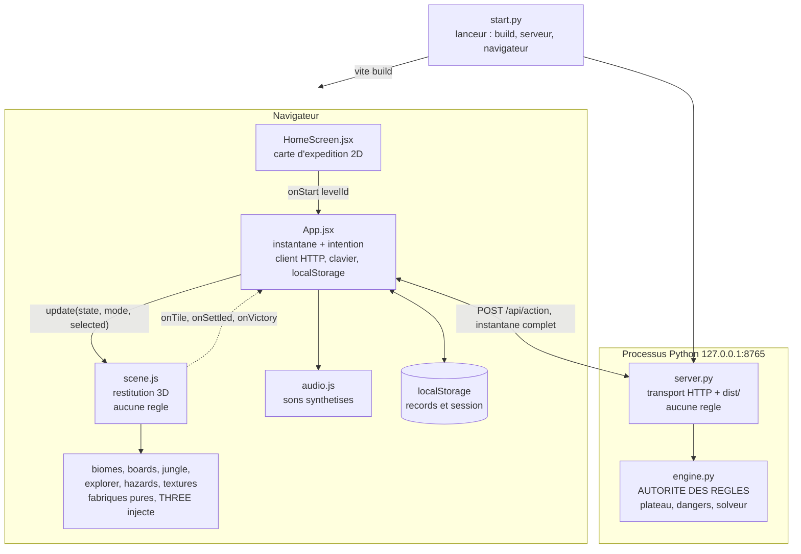

# Bienvenue dans LUMEN

> **Ajout du 10 septembre 2026 :** la refonte de la boutique, ses 80 entrées dont 18 familiers et son économie sont documentées dans [Boutique et collections](boutique.md). Le README racine décrit les commandes actuelles. Les autres documents de rétrodocumentation conservent leurs relevés datés.

Ce document est la porte d'entrée du workspace de rétrodocumentation de **LUMEN — Les chemins oubliés**. Il s'adresse à toute personne qui découvre le dépôt : il dit ce qu'est le projet, quel document lire selon ce qu'on cherche, et par où commencer selon le temps disponible. Il ne contient aucune référence complète — chaque sujet a son document dédié.

## Ce qu'est LUMEN

LUMEN est un jeu de taquin d'aventure. Sur un plateau 4 × 4, on fait glisser des **dalles** percées de couloirs pour construire un chemin continu, puis on fait **marcher** un personnage (Lumen) le long de ce chemin, de l'entrée à l'ouest jusqu'au portail de sortie à l'est. La dalle sur laquelle Lumen se tient est verrouillée : il faut donc alterner taquin et déplacement. La campagne compte **24 niveaux** répartis en 3 mondes : chacun garde ses **5 passages d'origine** (jungle, Atlantide, volcan — crocodile, courant, dalle fragile), puis des **épreuves** qui ajoutent crocodiles en maraude, sceaux et portes, marée et réactions en chaîne. Seize passages cachent une relique facultative ([backend/engine.py](../backend/engine.py)).

À l'écran, le jeu tourne dans un navigateur : une carte d'expédition en 2D pour choisir sa destination, puis un plateau rendu en 3D isométrique (Three.js) avec un personnage articulé, des dalles qui glissent en fondu et des pierres qui s'effondrent derrière le joueur. Le tout est servi par un unique processus Python local sur `http://127.0.0.1:8765`, lancé d'un geste par [start.py](../start.py).

## Les documents du workspace

| Document | À qui il s'adresse | Quand le lire |
|---|---|---|
| [00 — Bienvenue dans LUMEN](README.md) | tout le monde | ce document, en premier |
| [01 — Démarrage : faire tourner le jeu](01-demarrage.md) | tout nouvel arrivant | avant tout le reste, pour avoir le jeu sous les yeux |
| [02 — Architecture et flux de données](02-architecture.md) | développeur, quel que soit son bout | juste après le démarrage ; rend tous les autres documents lisibles |
| [03 — Le moteur de jeu (`backend/engine.py`)](03-moteur-de-jeu.md) | qui touche aux règles, aux niveaux ou aux indices | avant de modifier une règle ou d'ajouter un niveau |
| [04 — Contrat de l'API HTTP](04-api-http.md) | qui écrit un client, un test d'intégration ou un outil | quand une requête ne renvoie pas ce qu'on attend |
| [05 — Le front React : écrans et état](05-frontend-react.md) | qui touche à l'interface, aux écrans ou au clavier | avant de modifier `App.jsx` ou `HomeScreen.jsx` |
| [06 — Le rendu 3D : scène, décor et animation](06-rendu-3d.md) | qui touche à la scène, au décor ou aux animations | avant d'ouvrir `src/scene.js`, le plus gros fichier du projet |
| [07 — Tests, qualité et garde-fous](07-tests-et-qualite.md) | tout le monde, avant de livrer | avant le premier commit, et à chaque fois qu'un test casse |
| [08 — Glossaire et décisions de conception](08-glossaire-et-decisions.md) | tout le monde | en parallèle des autres ; à consulter dès qu'un mot est ambigu |
| [09 — Carte du code, fichier par fichier](09-carte-du-code.md) | qui cherche « où est-ce que ça se passe » | quand on ne sait pas dans quel fichier aller |
| [10 — Contribuer au projet](10-contribuer.md) | qui va livrer du code | avant la première modification |

> Déduit : ce workspace `docs/` est neuf. Le [README.md](../README.md) racine existant reste la notice destinée au **joueur** (installation, règles, raccourcis) ; [IDEES.md](../IDEES.md) est une feuille de route de mécaniques **non implémentées** — ses 14 cases à cocher sont toutes vides. Aucun des deux n'est une documentation technique, d'où ce workspace.

## Trois parcours de lecture

### « Je veux juste faire tourner le jeu » — 10 minutes

1. Lire [01 — Démarrage](01-demarrage.md), section prérequis. Deux cas très différents : jouer avec un `dist/` déjà construit (Python seul), ou construire depuis les sources (Node et un accès réseau au premier lancement). Attention : `dist/` est exclu par [.gitignore](../.gitignore), donc un `git clone` impose toujours le second cas.
2. Lancer le jeu. Sous Windows, [Lancer-le-jeu.cmd](../Lancer-le-jeu.cmd) ; sinon `python start.py`.
3. Si ça bloque, la section dépannage de [01 — Démarrage](01-demarrage.md) puis celle du [README.md racine](../README.md).

À ne pas faire dans ces 10 minutes : ouvrir `src/scene.js`.

### « Je dois corriger un bug de gameplay » — 1 heure

1. **[02 — Architecture](02-architecture.md)** (15 min) — la question à trancher en premier : le comportement fautif relève-t-il d'une **règle** (Python) ou d'une **restitution** (client) ? Le serveur détient la totalité des règles ; le client ne calcule aucun coup, il valide ses clics contre les listes reçues.
2. Puis, selon la réponse :
   - règle, trajet, danger, indice, compteur → **[03 — Le moteur de jeu](03-moteur-de-jeu.md)**, et notamment `Game.act` ([backend/engine.py:328](../backend/engine.py#L328)), seul point de mutation de l'état, et `Game.state()` ([backend/engine.py:304](../backend/engine.py#L304)), seul point de lecture ;
   - message d'erreur, code HTTP, forme du JSON → **[04 — Contrat de l'API HTTP](04-api-http.md)** ;
   - clic, clavier, écran, interface figée → **[05 — Le front React](05-frontend-react.md)** ;
   - couleur, animation, dalle qui ne bouge pas → **[06 — Le rendu 3D](06-rendu-3d.md)**.
3. **[07 — Tests](07-tests-et-qualite.md)** (15 min) — écrire le test qui reproduit le bug avant de corriger. Les règles sont bien couvertes ; le rendu et l'interface ne le sont pas du tout.

Réflexe utile : une interface qui reste bloquée n'est presque jamais un problème réseau. Le déverrouillage après une action passe par la boucle de rendu 3D — voir la surprise n° 2 ci-dessous.

### « Je dois ajouter du contenu ou une fonctionnalité » — une demi-journée

1. **[10 — Contribuer](10-contribuer.md)** (30 min) — environnement de développement depuis un `git clone`, boucle de travail, ce qu'il faut vérifier avant de livrer.
2. **[02 — Architecture](02-architecture.md)** puis **[08 — Glossaire et décisions](08-glossaire-et-decisions.md)** (1 h) — le glossaire évite de réinventer un vocabulaire concurrent ; les décisions expliquent pourquoi le découpage est tel quel, ce qui évite de « corriger » un choix assumé.
3. **[09 — Carte du code](09-carte-du-code.md)** (30 min) — repérer les fichiers à toucher. Point critique : les identifiants de niveau et de monde sont **redéclarés côté client** sans aucune vérification croisée. Ajouter un niveau côté Python sans l'ajouter dans [src/boards.js](../src/boards.js) n'échoue nulle part et dégrade silencieusement le décor.
4. Le document du sous-système concerné : **[03](03-moteur-de-jeu.md)** pour un niveau ou une règle, **[06](06-rendu-3d.md)** pour du décor, **[05](05-frontend-react.md)** pour de l'interface.
5. **[07 — Tests](07-tests-et-qualite.md)** (reste du temps) — la campagne est auto-validée à l'import du module : un niveau insoluble empêche le serveur de démarrer. C'est un garde-fou, pas une panne.

## Carte mentale du système



Une seule chose à retenir de ce schéma : **la vérité de l'état de jeu vit dans `engine.py`, et nulle part ailleurs**. Tout ce qui est côté navigateur n'est qu'une représentation, remplacée en bloc à chaque réponse du serveur. Le détail des flux est dans [02 — Architecture](02-architecture.md).

## Les 5 choses qui surprennent tout le monde

### 1. `npm test` n'existe pas

[package.json](../package.json) ne déclare que `dev`, `build` et `preview`. Les commandes réelles, vérifiées, sont :

```sh
python -m unittest discover -s backend
node --test tests/motion.test.js
npm run build
```

Ce sont exactement les trois commandes de la section « Vérification » du [README.md racine](../README.md). Mesuré à la date de ce document : 30 tests Python en 1,7 s, 7 tests Node en 0,3 s. Il n'y a **aucune intégration continue, aucun linter, aucun formateur** dans le dépôt.

### 2. L'interface se déverrouille depuis la boucle de rendu 3D

Après une action, `act` verrouille l'interface, puis **ne la déverrouille pas** : il délègue à la scène. Le déverrouillage immédiat n'a lieu que si la scène est absente (`if (!scene.current) setWorking(false)`, [src/App.jsx:162](../src/App.jsx#L162)) ; sinon c'est le rappel `onSettled` ([src/App.jsx:240](../src/App.jsx#L240)) qui s'en charge, et la scène ne l'émet que lorsque le personnage est immobile **et** que chaque dalle est à moins de 0,004 unité de sa cible ([src/scene.js:851](../src/scene.js#L851)).

Conséquence : toute investigation « l'interface est figée » commence par `onSettled`, jamais par le réseau. Voir [05 — Le front React](05-frontend-react.md) et [06 — Le rendu 3D](06-rendu-3d.md).

### 3. Le protocole a l'air générique, le client ne l'est pas

Le serveur envoie `size: 4`, `entry` et `exit` dans chaque instantané ([backend/engine.py:304](../backend/engine.py#L304)). Vérifié : **`App.jsx` ne lit jamais `size`** et écrit `4`, `16` et `-1` en dur. Changer `SIZE` côté Python casserait le client sans lever la moindre erreur.

Même piège sur les identifiants : [src/boards.js](../src/boards.js) redéclare les 15 identifiants de niveau avec leur propre colonne de monde, et retombe silencieusement sur le profil du niveau `aube` pour tout identifiant inconnu ([src/boards.js:19](../src/boards.js#L19)) ; `getBiome` retombe de même sur la jungle ([src/campaign.js:22](../src/campaign.js#L22)). Détail dans [09 — Carte du code](09-carte-du-code.md).

### 4. Deux compteurs, deux unités — et un seul record

`moves` compte les **glissades** de dalles, jamais les pas. `steps` compte les **arêtes marchées**. Seul `moves` sert de record, et ce record est calculé et stocké **exclusivement par le navigateur** : le serveur ne persiste rien. Quatre clés de `localStorage` seulement, listées par `SAVE_KEYS` ([src/campaign.js](../src/campaign.js)) — `lumen-session`, `lumen-level`, `lumen-progress`, `lumen-wardrobe`. `lumen-progress` porte `{ moves, completed, relic, score }`, et c'est `completed` qui **déverrouille le niveau suivant** : la campagne s'ouvre un passage à la fois, règle tenue par le client seul.

Corollaire : redémarrer le processus Python détruit toutes les parties en cours ; le client absorbe le 404 et crée une partie neuve. Les records, eux, survivent.

### 5. Le contrat JSON a trois pièges vérifiés

- `reachable` **inclut** la case du personnage, `walkRoutes` **l'exclut**. Mesuré sur `aube` avec le personnage en case 1 : `reachable = [0, 1, 2]` mais les clés de `walkRoutes` sont `['2', '0', '-1']`. Un test naïf `reachable.length > 0` conclurait à tort qu'un déplacement est possible.
- Les clés de `walkRoutes` sont des **chaînes**, y compris `"-1"` et `"16"`. Toujours indexer via `String(destination)`.
- `walkPath` est **conditionnelle** : absente d'une partie neuve (vérifié), présente après une marche, et après l'annulation d'une marche elle contient le trajet **inversé** — le client ne peut pas distinguer les deux cas.

L'instantané compte **23 clés fixes** plus `walkPath`. Fiches complètes dans [04 — Contrat de l'API HTTP](04-api-http.md).

## Conventions d'écriture de cette documentation

### Langue

| Catégorie | Langue |
|---|---|
| Cette documentation, l'interface, les messages destinés au joueur | **français** |
| Code, commentaires, docstrings, noms de symboles, noms de tests | **anglais** |
| Clés du contrat JSON (`levelId`, `walkRoutes`, `emptyCells`…) | **anglais camelCase — ne jamais franciser** |
| Messages console de [start.py](../start.py) et du `.cmd` | **français sans accent** (page de code Windows) |

La consigne « le projet et ses commentaires sont en français » est contredite par le code : la totalité des commentaires et des noms de symboles est en anglais. La règle réelle est celle du tableau ci-dessus. Détail dans [08 — Glossaire et décisions](08-glossaire-et-decisions.md).

### Un concept, un mot

Le glossaire de [08](08-glossaire-et-decisions.md) tranche les synonymes. Les arbitrages les plus utiles : **dalle** (pas pierre ni tuile), **case** (l'emplacement) contre **dalle** (l'objet), **vide** (pas trou), **ouverture** (pas port), **glisser** / **marcher**, **déplacements** / **pas**, **monde** en français contre `biome` comme identifiant technique.

Un mot est proscrit : **« chapitre »**. Il désigne trois choses différentes dans le code — `item.chapter` (1..15, serveur), une variable locale de `App.jsx` indexée à partir de 0, et un libellé d'onglet qui affiche en réalité `biomeLevel` (1..5). La documentation dit « numéro » (1..15) ou « rang » (1..5).

### Trois registres, toujours distingués

- **Constaté** : lu dans le code, avec un lien vers le fichier et la ligne. C'est le registre par défaut.
- **Déduit** : interprétation, signalée par un bloc `> Déduit :`.
- **Piste d'amélioration** : proposition, signalée par un bloc `> Piste d'amélioration :`. Jamais présentée comme un fait.

Ce qui n'a pas pu être établi est écrit tel quel : « non déterminé à la lecture du code ». Une documentation qui ment coûte plus cher que pas de documentation.

### Forme

Titre H1 unique, chapeau de 2 à 4 lignes disant à qui le document s'adresse, puis des sections H2/H3. Tableau markdown pour tout ce qui est énumératif. Bloc mermaid seulement quand un schéma apporte plus qu'un tableau. Chaque document se termine par « Pour aller plus loin ». Densité plutôt que volume : un tableau exact vaut mieux que trois paragraphes vagues.

## Comment maintenir cette documentation à jour

**Règle de survie n° 1 : ne jamais faire confiance à un chiffre écrit dans un document de ce projet.** Le dépôt bouge plus vite que sa documentation. Quatre écarts constatés à la rédaction de ce document :

| Affirmation d'un document amont | Mesure réelle à la date de ce document |
|---|---|
| `src/scene.js` fait 816 lignes, puis 905 | **961** |
| `src/App.jsx` fait 405 lignes, puis 407 | **431** |
| `setSafeArea` est exposé mais jamais appelé | **appelé** par [src/App.jsx:257](../src/App.jsx#L257) |
| un seul commit initial | **2 commits** (`46764d9`, `5d3a106`), plus trois fichiers modifiés non commités |

D'où la procédure :

1. **Recompter avant d'affirmer un chiffre.** `wc -l`, `git log --oneline`, et relancer les deux suites de tests. Ne recopiez jamais un nombre depuis un autre document.
2. **Vérifier tout numéro de ligne cité** avant de le reprendre. Les liens de cette documentation pointent vers des lignes précises : ils se périment silencieusement.
3. **Ne jamais écrire une commande sans l'avoir exécutée.** Les seules sources légitimes sont [package.json](../package.json), [start.py](../start.py) et [Lancer-le-jeu.cmd](../Lancer-le-jeu.cmd).
4. **Mettre à jour le document concerné dans le même changement que le code.** Modifier une règle sans toucher à [03](03-moteur-de-jeu.md), ou une route sans toucher à [04](04-api-http.md), crée une documentation fausse — le pire résultat possible.
5. **Ajouter un fait au registre « constaté » uniquement avec sa source.** Sans lien vérifiable, le fait relève du « déduit » ou reste signalé comme non déterminé.

> Piste d'amélioration : rien n'automatise ces vérifications. Un script qui recompterait les lignes citées et relancerait les trois commandes de vérification supprimerait la principale cause d'obsolescence de ce workspace. Aucune intégration continue n'existe aujourd'hui pour l'accueillir.

## Pour aller plus loin

- [01 — Démarrage : faire tourner le jeu](01-demarrage.md) — la suite immédiate de ce document.
- [02 — Architecture et flux de données](02-architecture.md) — le découpage en couches et qui détient la vérité de l'état.
- [08 — Glossaire et décisions de conception](08-glossaire-et-decisions.md) — le vocabulaire canonique et le pourquoi des choix.
- [09 — Carte du code, fichier par fichier](09-carte-du-code.md) — pour trouver le bon fichier.
- [10 — Contribuer au projet](10-contribuer.md) — avant votre première modification.
